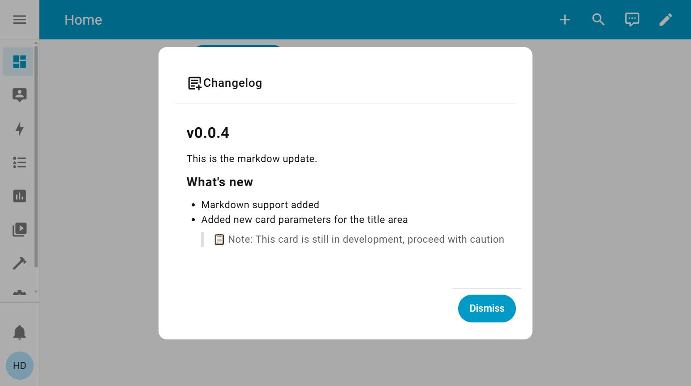

# Harmonie's Changelogs



Harmonie's Changelogs is a custom Lovelace card for Home Assistant that allows you to display a changelog for your Home Assistant instance. It is designed to be simple and easy to use, and it can be customized to fit your needs. The changelog is stored in an `input_text` entity, which can be updated manually or through automation, and it supports markdown formatting. The changelog popup auto shows the first time after an update, and can be configured to show a button to open it manually... or not.

## Table of Contents

- [Installation](#installation)
- [How To Use](#how-to-use)
- [Card](#card)
- [Contributing](#contributing)
- [Donate](#donate)

## Installation

### HACS Installation (Recommended)
Use this button to add the repository to your HACS:

[](https://my.home-assistant.io/redirect/hacs_repository/?owner=harmonie-durrant&repository=harmonie-changelogs&category=frontend)

or follow these steps:
1. Add this repository to HACS by including it as a custom repository:
  - Go to `HACS` > `Integrations` > `⋮` > `Custom repositories`.
  - Paste the URL of this repository and select Lovelace as the category.
2. Install the Entity Progress Card from HACS.

### Manual Installation

1. Clone the repository into the `/config/www/` directory in your Home Assistant setup.
2. Add `/local/harmonie-changelogs/dist/index.js` to your Lovelace resources
```yaml
url: /local/harmonie-changelogs/dist/index.js
type: module
```
3. if you are updating just replace the old file with the new and clear your browser cache. (or append `?v=x` to the end of the url where x is a number you increase with each update)

## How to use

The Changelog card allows you to display a changelog for your Home Assistant instance. To use the card, add the following configuration to your Lovelace dashboard:

```yaml
type: custom:changelog-card
entity: input_text.changelog
hide_button: true
```


```yaml
type: custom:changelog-card
entity: input_text.changelog
hide_button: true

```

## Contributing

Feel free to fork this repo and submit your changes through pull requests, or to suggest a feature/report a bug, make an issue in the issues tab of this repository.

When developing run `npm install` to setup the project, and `npm run build` or `npm run watch` to build the project. (The watch command will automatically rebuild the project when you save a file)

## Links

[Discord Server for support and discussion](https://discord.gg/Cjakvt9XJH)

[Buy me a coffee.](https://buymeacoffee.com/harmonie)
